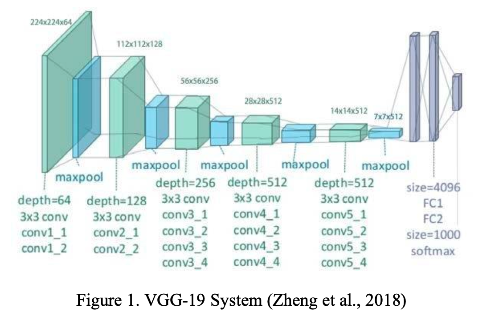
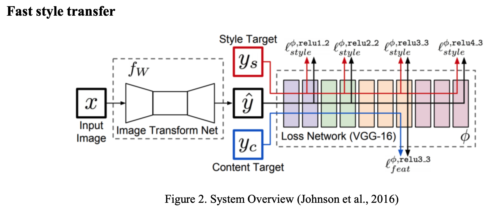
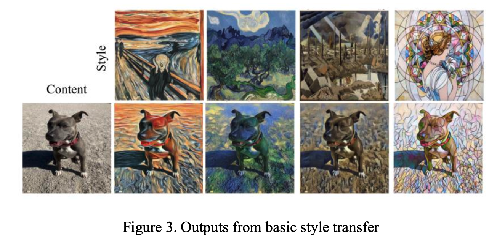
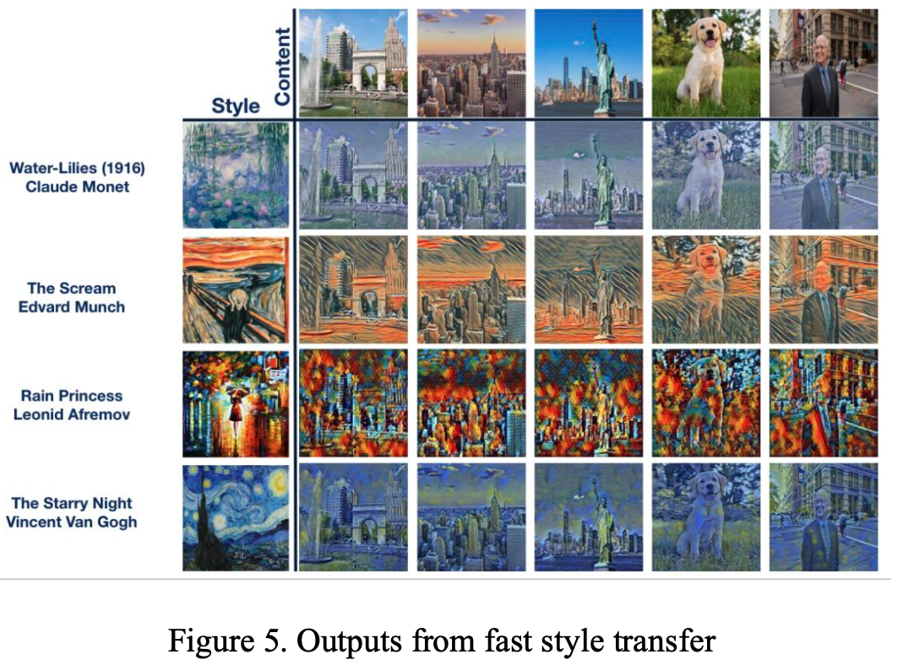

# Neural Style Transfer

**Group members: Yuejiao Qiu, Ruoting Shen, Wenxuan(Ivy) Tang, Yuening Wang, Sirui Wang**

## Project overview and objective

We are inspired by the filter effects in diverse mobile applications that we can transform an image into another image which keeps the same content, such as objects and shapes while changing the styles. However, sometimes, the filters are not satisfying enough, it suffers from shading, brightness, contrast, etc.

In this project, we aim to design a more flexible way to convert the image style completely. By providing another image, such as diverse artists’ masterpieces or various photographers’ work with distinct styles, we adopt these styles as the “filter effects” to transform the content image. The building block is to transform the style to the utmost extent while preserving the object in the original image as much as we could. Besides, we intended to try out different algorithms and network architectures to maximize the performance of style transformation as well as the runtime.

## Proposed Data Source and Methods

The main algorithm we implement in the project is Convolutional Neural Network (CNN). Based on the previous research, neural style transfer (NST) has two main fields: image- optimization-based (IOB) online neural methods and model-optimization-based (MOB) offline neural methods. Basic style transfer realizes a style render of one fixed style to one fixed content using IOB-NST algorithms proposed by Gatys et. al(2016), which utilizes a pre-trained VGG19 as the loss network. For the MOB-NST model, we will basically follow Johnson et. al (2016) and Ulyanov et. al (2017) to use a feed-forward network optimized over a sufficiently large number of content images for each style. And Shen et. al (2018) proposed a novel method to generate specified network parameters in the meta networks, which archives real-time transfer of any style and content. But due to the limit of space and resources, it might be challenging for us to implement.

In the experiments, we attempt different models and choose the one with the best performance. Different algorithms and loss functions are included to evaluate the results. After comparison, we evaluate the selected model based on transformation accuracy at last.

### Basic style transfer
IOB-NST algorithms extract style and content from source images to produce a target representation and then output the stylized results that match target representations through iterations (Jing et al., 2019). However, this model is also limited by its iterative optimization process, which leads to low efficiency.

A pre-trained VGG-19 (Figure 1) is utilized as the loss network, implementing an irreversible network consisting of 16 layers of convolution and 5 layers of pooling. The selection of styles and content layers is an important part of style transformation. According to the study by Gatys et al. (2016), conv1_1, conv2_1, conv3_1, conv4_1, and conv5_1 are used as style layers and conv4_2 as the content layer. The loss can be calculated with the features in layers. The goal is to transfer the style of the source image onto the target image. The final new image matches both the content and style. And LBFG_S is utilized as an optimizer to iteratively adjust the gradient and minimize the total loss.


#### Code
1. [Basic Style Transfer](/code/1_BasicStyleTransfer.ipynb)

### Fast style transfer
Although the basic style transfer shows quite exceptional results, it still has many limitations, and the most significant one is the efficiency problem. That is, if a new style or content of the image is supposed to be used, the basic style transfer model requires inputting a new image and iterating every time. Therefore, in order to improve the speed and reduce the computational cost, the MOB-NST algorithms are implemented to create a new model which can conduct a real- time style transfer.

The MOB-NST algorithm can be achieved through three methods, which are Per-Style- Per-Model (PSPM) MOB-NST methods, Multiple-Style-Per-Model (MSPM) MOB-NST Methods, and Arbitrary-Style-Per-Model (ASPM) MOB-NST Methods. The first two MOB-NST algorithms are raised by Ulyanov et al. and Johnson et al., both of them can pre-train a feed-forward network and generate stylized results with a single forward pass during the test phase (Jing et al., 2019). The only difference is that Johnson et al. use residual blocks and fractionally strided convolutions, while Ulyanov et al. use a multi-scale generator network (Jing et al., 2019).



#### Code
1. [Kanagawa Style Transfer](code/2_FastTransfer_Kanagawa.ipynb)
2. [Old Canal Port Style Transfer](code/2_FastTransfer_OldCanalPort.ipynb)
3. [Portrait Style Transfer](code/2_FastTransfer_Portrait.ipynb)
4. [Rain Princess Style Transfer](code/2_FastTransfer_RainPrincess.ipynb)
5. [Scream Style Transfer](code/2_FastTransfer_Scream.ipynb)
6. [Starry Night Style Transfer](code/2_FastTransfer_StarryNight.ipynb)
7. [WaterLilies Style Transfer](code/2_FastTransfer_WaterLilies.ipynb)

## Result
### Basic style transfer
As Figure 3 shows, basic style transfer successfully transfers the textures of image style with the preservation of the content, and style and content are roughly mixed. Unfortunately, one major limitation is that the model requires a new input and iteration in order to use a new style or content of the image and iteratively apply the gradient descent to minimize the loss during the process. In the experiment with GPU, with the number of iterations set to 800, the average time to output the image is 63.27 seconds, which is too slow for business purposes. Therefore, fast style transfer is built to achieve the real-time style transfer, which will be conducted and discussed in the following.


### Fast style transfer
Figure 5 is a demonstration of the results for all models. The average time to transform a random image is approximately 0.17 seconds once the painting-specific style transfer model is trained, which partially implements real-time style transfer, especially when compared to the one- minute run time of the basic transfer. For a stronger test of the model performance, images with numbers were examined and better results were obtained. The model not only transferred the color but also the texture of the style painting. Simultaneously, the objects in the content images are well preserved, sharp object shapes can still be noticed in the output images, regardless of the relatively messy stylized paintings.



## Repository structure

 The repository has the following structure:

```.
├── README.md
├── code/
├── result/
├── writeup/
└── img/

```
### Description

* The `code/` directory is where we wrote all of scripts. 
* The `result/` directory contains the visualization of the model result.
* The `writeup/` directory contains our proposal final report and presentation slide.
* The `img/` directory contains screenshots for the README.